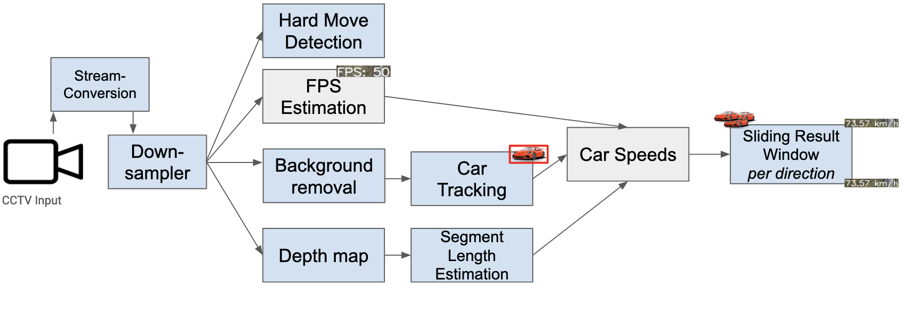

# Traffic speed estimation for uncalibrated camera footage

Goal of this repository is to provide an easy way of estimating the speed of traffic from uncalibrated video footage.

## Structure

Our current approach is stored in the `object_detection_yolo` folder. It contains a `config.ini`, where some configuration can be changed.

|Name|Description|Values|
|-|-|-|
| fps | Default FPS to use, if they can't be detected from the provided video | integer |
| custom_object_detection | Wether to use the custom trained yolov5 model or pretrained yolov4 (default) | boolean |
| avg_frame_count | | float |
| speed_limit | Speed limit on the road segment shown in the video (in km/h) | integer |

The project is split into multiple modules, each handling a part of the total pipeline.


The different modules of this project can be found inside the folder *object_detection_yolo/modules*
Currently, there are:
| Module Name | Folder | Description |
|-|-|-|
| Car Tracking | modules/object_detection | Contains yolov4 and v5 for detecting cars in a video frame |
| Depth map | modules/depth_map | Generates a depth map for a provided frame, using Pixelformer or Midas model |
| Hard Move Detection | modules/shake_detection | Detects if the frame moved |
| Stream-Conversion & Downsampler | modules/streaming | Reads a stream, caps it to 30FPS and provides the frames |
| Evaluation | modules/evaluation | Compares videos with the provided ground truth |


## Setup

Running the code can be done in two ways:

1. Locally
2. Docker (with CUDA support)

The advantage of the Docker container is that it supports CUDA acceleration out of the box. Locally, you'll have to set it up yourself ;)

### Local Setup

0. (Have python virtual environments set up, e.g. through `conda`)
1. Install requirements from `environment.yml`
2. Install [ffmpeg](https://ffmpeg.org/) for your machine.
```sh
# Mac
> brew install ffmpeg
# Ubuntu / Debian
> sudo apt install ffmpeg
```
3. Go to `object_detection_yolo/object_tracking.py` and run it

### Docker Setup
0. (Have `docker` installed)
1. Go to `docker` directory in a terminal
2. Run `docker build .` Assign a tag, if you like.
3. Run the docker container with the following command:
```
docker run --rm \
        --gpus '"device=0"' -v $PATH_TO_REPO:/storage -v $PATH_TO_VIDEO_ROOT_FOLDER:/scratch2 \
        -t cv-cuda python3 /storage/object_detection_yolo/object_tracking.py \
        "$PATH_TO_VIDEO_FILE_IN_DOCKER"
```
Replace `$PATH_TO_REPO`, `$PATH_TO_VIDEO_ROOT_FOLDER` and `$PATH_TO_VIDEO_FILE_IN_DOCKER` with the paths on your machine.

## Run

The path to the video that should be analysed can be set in *object_detection_yolo/paths.py* or provided to `object_detection_yolo/object_tracking.py` as argument `--path`

An example run command could be `python object_detection_yolo/object_tracking.py '/data/my_video.mp4'`
