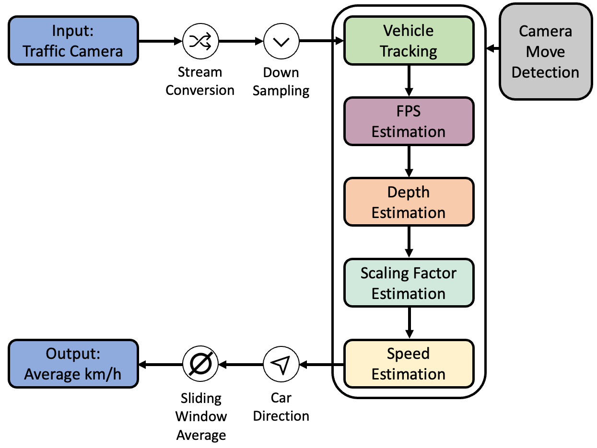

# A Self-Calibrating End-to-End Pipeline for Real-Time Speed Estimation for Traffic Monitoring

### This repository provides an easy way of estimating the speed of traffic leveraging uncalibrated video footage.

## Structure
The project is split into multiple modules, each handling a part of the total pipeline.



The different modules of this project can be found inside the folder *speed_estimation/modules*
Currently, there are:

| Module Name | Folder                                  | Description                                                                                                                                                              |
|-------------|-----------------------------------------|--------------------------------------------------------------------------------------------------------------------------------------------------------------------------|
| Depth map   | modules/depth_map                       | Generates a depth map for a provided frame, using a customized version of the [Pixelformer](https://github.com/ashutosh1807/PixelFormer).                                                                           |
| Evaluation  | modules/evaluation                      | Compares videos with the provided ground truth on the BrnoCompSpeed Dataset.                                                                                             |
| Car Tracking| modules/object_detection                | Contains yolov4 model for detecting cars in a video frame. If you want to use your own model, place it in the folder `modules/object_detection/custom_object_detection`. |
| Calibration | modules/scaling_factor                  | Automatically calibrates the pipeline at start and derives a scaling factor.                                                                                             |
| Shake Detection | modules/shake_detection             | Detects if the frame moved                                                                                                                                               |
| Stream-Conversion & Downsampler | modules/streaming | Reads a stream, caps it to 30FPS and provides the frames                                                                                                                 |

## Setup

Running the code can be done in two ways:

1. Locally
2. Docker (with CUDA support)

The advantage of the Docker container is that it supports CUDA acceleration out of the box. Locally, you'll have to set
it up yourself ;)

### Local Setup

0. (Have python virtual environments set up, e.g. through `conda`)
1. Install requirements from `environment.yml` or if you are using macOS from `environment_mac.yml`:\
`conda env create -f environment.yml`
2. `conda activate farsec`
3. Install [ffmpeg](https://ffmpeg.org/) for your machine.

```sh
# Mac
> brew install ffmpeg
# Ubuntu / Debian
> sudo apt install ffmpeg
```
4. `cd scripts/`
5. Run `/bin/bash customize_pixelformer.sh`. With this command the pixelformer repository will be cloned into the correct folder hierarchy and for this use case customized.
6. If you want to clean up the customization scripts used in step 5, run `/bin/bash cleanup.sh`. This step is not mandatory. 
7. Download the weights for the depth map from
   here: https://drive.google.com/file/d/1s7AdfwrV_6-svzfntBJih011u2IGkjf4/view?usp=share_link
8. Place the weights in that folder: `speed_estimation/modules/depth_map/PixelFormer/pretrained`
9. Update the paths in `speed_estimation/paths.py`

### Docker Setup

0. (Have `docker` installed)
1. Go to `docker` directory in a terminal
2. Run `docker build .` Assign a tag, if you like.
3. Run the docker container with the following command:

```
docker run --rm \
        --gpus '"device=0"' -v $PATH_TO_REPO:/storage -v $PATH_TO_VIDEO_ROOT_FOLDER:/scratch2 \
        -t cv-cuda python3 /storage/speed_estimation/speed_estimation.py \
        "$PATH_TO_SESSION_DIRECTORY" "$PATH_TO_VIDEO_FILE_IN_DOCKER"
```

Replace `$PATH_TO_REPO`, `$PATH_TO_VIDEO_ROOT_FOLDER, "$PATH_TO_SESSION_DIRECTORY"` and `$PATH_TO_VIDEO_FILE_IN_DOCKER` with the paths on your
machine.

#### Note: This repository has a default configuration (`speed_estimation/config.ini`) that can be adjusted if necessary (see Section Configuration).


## Configuration
This project comes with a default configuration, which can be adjusted. To do so have a closer look into `speed_estimation/config.ini`

| Name                               | Description                                                                                                                                                                 | Values |
|------------------------------------|-----------------------------------------------------------------------------------------------------------------------------------------------------------------------------|--------|
| fps                                | Default FPS to use, if they can't be detected from the provided video.                                                                                                      | integer |
| custom_object_detection            | Wether to use your custom trained model or pretrained yolov4 (default).                                                                                                     | boolean |
| sliding_window_sec                 | Seconds to use for the sliding window, in which the speed es estimated.                                                                                                     | integer |
| num_tracked_cars                   | Number of cars the pipeline should use to calibrate itself.                                                                                                                 | integer |
| num_gt_events                      | Number of ground truth events the pipeline should use to calibrate itself.                                                                                                  | integer |
| car_class_id                       | The class the detection model uses to identify a vehicle.                                                                                                                   | integer |
| max_match_distance                 | Maximum distance for that bounding boxes are accepted (from the closest bounding box).                                                                                      | integer |
| object_detection_min_confidence_score | The minimum allowed score with which the model should recognize a vehicle.                                                                                                  | float  |
| speed_limit                        | Speed limit on the road segment shown in the video (in km/h).                                                                                                               | integer |  
| avg_frame_count                    | Output of meta statistics approach gets written here. Average frames a standard car was taking to drive through the CCTV segment (average tracked over a longer time frame). | float  |
| use_cpu                            | Wether the CPU should be used or not. If set to false the GPU will be used.                                                                                                 | integer |

Additionally, the `speed_estimation/paths.py` can be adjusted.

| Name                         | Description                                                    | Values |
|------------------------------|----------------------------------------------------------------|--------|
| PATH_TO_HAAR_FILE            | Path to the HAAR file required for the object detection model. | string |
| YOLOV4_WEIGHTS               | Path to the model weights.                                     | string |
| YOLOV4_CLASSES               | Path to the different classes the model can detect.            | string |
| YOLOV4_CONFIG                | Path to config file of model.                                  | string |
| SESSION_PATH                 | Directory where the video that should be analyzed is stored.   | string |
| VIDEO_NAME                   | The name of the video that should be analyzed.                 | string |
| SPEED_ESTIMATION_CONFIG_FILE | Location of the `config.ini` file described above.             | string |

## Dataset

As a test dataset to run the estimation on, we provide you with an excerpt of the BrnoCompSpeed Dataset.
To get the full dataset, please contact {isochor,herout,ijuranek}@fit.vutbr.cz (see https://github.com/JakubSochor/BrnoCompSpeed).

1. Download the whole folder from here: https://1drv.ms/u/s!AmCOHF26iIAQgf1ladUQOKtY0an0dg?e=wa1iZX
2. Go to `speed_estimation/paths.py` and adjust the `session_path` accordingly

## Run

The path to the video should be given to `speed_estimation/speed_estimation.py` as argument.
If you do not give the path as argument adjust the `speed_estimation/paths.py` accordingly.
To get a visual output of the detections and tracking in the frame, set `enable_visual`.

1. `cd speed_estimation`
2. `python speed_estimation.py /path/to/session /path/to/video.mp4` or `python speed_estimation.py` (this will use the default paths configured).
The visual output will be enabled when running the following command `python speed_estimation.py /path/to/session /path/to/video.mp4 true`

During speed analysis the pipline will update the picture `speed_estimation/frames_detected/frame_after_detection`, which gives you an visual impression of what cars are detected and tracked.

## Evaluation

To evaluate the speed estimates, the repository holds the module `speed_estimation/modules/evaluation`.
This module is called as soon as the video footage is analyzed. Please note that the evaluation module was build on top of the BrnoCompSpeed dataset.
If you are not using this dataset, the evaluation module will not be applicable to you in a plug and play manner.
Feel free to extend the module to fit your requirements.

## How to cite

Please consider citing our paper if you use our code in your project.

Liebe L., Sauerwald F., Sawicki S., Schneider M., Schuhmann L., Buz T., Boes P., Ahmadov A. (2023). ["FARSEC: A Reproducible Framework for Automatic Real-Time Vehicle Speed Estimation Using Traffic Camera"] (https://arxiv.org/abs/XXXXX). arXiv preprint arXiv:XXXXXXX

```
@bibtex_ref{}
```
